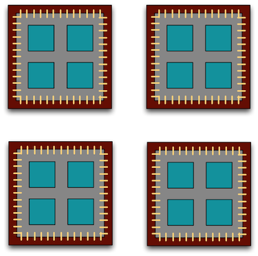

# Quick Intro to Parallel Computing in R

Shaghayegh Soudi,
September 20, 2021

* Learning Outcomes
* Understand what parallel computing is and when it may be useful
* Understand how parallelism can work
* Review sequential loops and ```*apply``` functions
* Understand and use the ```parallel``` package ```multicore``` functions
* Understand and use the ```foreach``` package functions


# Introduction

Processing large amounts of data with complex models can be time consuming. 
New types of sensing means the scale of data collection today is massive. 
And modeled outputs can be large as well.


# Why parallelism?

Much R code runs fast and fine on a single processor. But at times, computations can be:

* cpu-bound: Take too much cpu time
* memory-bound: Take too much memory
* I/O-bound: Take too much time to read/write from disk
* network-bound: Take too much time to transfer


To help with **cpu-bound** computations, we can take advantage of modern processor architectures that provide multiple cores on a single processor, and thereby enable multiple computations to take place at the same time. 
In addition, some machines ship with multiple processors, allowing large computations to occur across the entire cluster of those computers. Plus, these machines also have large amounts of memory to avoid **memory-bound** computing jobs.


# Processors (CPUs) and Cores

A modern CPU (Central Processing Unit) is at the heart of every computer. While traditional computers had a single CPU, modern computers can ship with mutliple processors, which in turn can each contain multiple cores. These processors and cores are available to perform computations. 

# Some terminologies
* A core: a general term for either a single processor on your own computer (technically you only have one processor, but a modern processor like the i7 can have multiple cores - hence the term) or a single machine in a cluster network.
* A cluster: a collection of objecting capable of hosting cores, either a network or just the collection of cores on your personal computer.
* A process: a single running version of R (or more generally any program). Each core runs a single process.

A computer with one processor may still have 4 cores (quad-core), allowing 4 computations to be executed at the same time.

 


A typical modern computer has multiple cores, ranging from one or two in laptops to thousands in high performance compute clusters. Here we show four quad-core processors for a total of 16 cores in this machine.




You can think of this as allowing 16 computations to happen at the same time. Theroetically, your computation would take 1/16 of the time (but only theoretically, more on that later).


Historically, R has only utilized one processor, which makes it single-threaded.Consider that we have a series of functions to run, f1, f2, etc. Serial processing means that f1 runs first, and until f1 completes, nothing else can run. Once f1 completes, f2 begins, and the process repeats.
This is a shame, because the 2016 MacBook Pro that I am writing this on is much more powerful than that:

```
$ sysctl hw.ncpu hw.physicalcpu
hw.ncpu: 12
hw.physicalcpu: 6
```

To interpret that output, my laptop powder has 6 physical CPUs, each of which has two processing cores, for a total of 12 cores for computation. I’d sure like my R computations to use all of that processing power. Because its all on one machine, we can easily use multicore processing tools to make use of those cores.

Now let’s look at the computational server gphost06:

```
(base) [ssoudi@gphost06 ~]$ lscpu | egrep 'CPU\(s\)|per core|per socket'
CPU(s):                144
On-line CPU(s) list:   0-143
Thread(s) per core:    2
Core(s) per socket:    18
NUMA node0 CPU(s):     0-17,72-89
NUMA node1 CPU(s):     18-35,90-107
NUMA node2 CPU(s):     36-53,108-125
NUMA node3 CPU(s):     54-71,126-143
```


# When to parallelize
It’s not as simple as it may seem. While in theory each added processor would linearly increase the throughput of a computation, there is overhead that reduces that efficiency. For example, the code and, importantly, the data need to be copied to each additional CPU, and this takes time and bandwidth. Plus, new processes and/or threads need to be created by the operating system, which also takes time. This overhead reduces the efficiency enough that realistic performance gains are much less than theoretical, and usually do not scale linearly as a function of processing power. For example, if the time that a computation takes is short, then the overhead of setting up these additional resources may actually overwhelm any advantages of the additional processing power, and the computation could potentially take longer!
So, its important to evaluate the computational efficiency of requests, and work to ensure that additional compute resources brought to bear will pay off in terms of increased work being done. 

**note**: sometimes a task cannot be paralellized at all. when?  for example, if f2 depended on the output of f1 before it could begin, even if we used multiple computers, we would gain no speed-ups.


# Loops and repetitive tasks using lapply

When you have a list of repetitive tasks, you may be able to speed it up by adding more computing power. If each task is completely independent of the others, then it is a prime candidate for executing those tasks in parallel, each on its own core. For example, let’s build a simple loop that uses sample with replacement to do a bootstrap analysis:


```
x <- iris[which(iris[,5] != "setosa"), c(1,5)]
trials <- 10000
res <- data.frame()
system.time({
  trial <- 1
  while(trial <= trials) {
    ind <- sample(100, 100, replace=TRUE)
    result1 <- glm(x[ind,2]~x[ind,1], family=binomial(logit))
    r <- coefficients(result1)
    res <- rbind(res, r)
    trial <- trial + 1
  }
})
```


```
##    user  system elapsed 
##  20.031   0.458  21.220
```

The issue with this loop is that we execute each trial sequentially, which means that only one of our 12 processors on this machine are in use. In order to exploit parallelism, we need to be able to dispatch our tasks as functions, with one task going to each processor. To do that, we need to convert our task to a function, and then use the ```*apply()``` family of R functions to apply that function to all of the members of a set. 
The apply() family pertains to the R base package and is populated with functions to manipulate slices of data from matrices, arrays, lists and dataframes in a repetitive way. These functions allow crossing the data in a number of ways and avoid explicit use of loop constructs. They act on an input list, matrix or array and apply a named function with one or several optional arguments, see a tutorial [here](https://www.datacamp.com/community/tutorials/r-tutorial-apply-family?utm_source=adwords_ppc&utm_campaignid=1655852085&utm_adgroupid=61045434622&utm_device=c&utm_keyword=%2Bapply%20%2Bfamily%20%2Br&utm_matchtype=b&utm_network=g&utm_adpostion=&utm_creative=318880582467&utm_targetid=aud-522010995285:kwd-589281896574&utm_loc_interest_ms=&utm_loc_physical_ms=9001527&gclid=CjwKCAjwhaaKBhBcEiwA8acsHIvnbB5Dm4H5yTz7k2HHeaLo0gNVEUyXvJuS4ZezB3DpxdDFGdSpOhoC0VkQAvD_BwE#family). In R, using ```apply``` is often significantly faster than the equivalent code in a loop . Here’s the same code rewritten to use ```lapply()```, which applies a function to each of the members of a list (in this case the trials we want to run):


```
x <- iris[which(iris[,5] != "setosa"), c(1,5)]
trials <- seq(1, 10000)
boot_fx <- function(trial) {
  ind <- sample(100, 100, replace=TRUE)
  result1 <- glm(x[ind,2]~x[ind,1], family=binomial(logit))
  r <- coefficients(result1)
  res <- rbind(data.frame(), r)
}
system.time({
  results <- lapply(trials, boot_fx)
})
```

```
##    user  system elapsed 
##  19.340   0.553  20.315
```

# Approaches to parallelization

When parallelizing jobs, one can:

   * Use the multiple cores on a local computer through mclapply
   * Use multiple processors on local (and remote) machines using makeCluster and clusterApply
        * In this approach, one has to manually copy data and code to each cluster member using clusterExport
        * This is extra work, but sometimes gaining access to a large cluster is worth it


# Parallelize using: mclapply (Linux only)
The ```parallel``` library can be used to send tasks (encoded as function calls) to each of the processing cores on your machine in parallel. This is done by using the ```parallel::mclapply``` function, which is analogous to lapply, but distributes the tasks to multiple processors. ```mclapply``` gathers up the responses from each of these function calls, and returns a list of responses that is the same length as the list or vector of input data (one return per input item).


You can easily check the number of cores you have access to with detectCores:

```
library(parallel)
numCores <- detectCores()
numCores
```

```
## [1] 12
```

```
f <- function(i) {
  lmer(Petal.Width ~ . - Species + (1 | Species), data = iris)
}
system.time(save1 <- lapply(1:100, f))
```

```
##    user  system elapsed 
##   2.048   0.019   2.084
```


```
system.time(save2 <- mclapply(1:100, f))
```

```
##    user  system elapsed 
##   1.295   0.150   1.471
```


**note** By default, ```mclapply``` will use all cores available to it. If you don’t want to (either becaues you’re on a shared system or you just want to save processing power for other purposes) you can set this to a value lower than the number of cores you have. Setting it to 1 disables parallel processing, and setting it higher than the number of available cores has no effect.

**note** Unfortunately, this approach only works on Linux. If you are working on a Windows machine, it will perform as a serial ```lapply```.


Now let’s demonstrate with our bootstrap example:

```
x <- iris[which(iris[,5] != "setosa"), c(1,5)]
trials <- seq(1, 10000)
boot_fx <- function(trial) {
  ind <- sample(100, 100, replace=TRUE)
  result1 <- glm(x[ind,2]~x[ind,1], family=binomial(logit))
  r <- coefficients(result1)
  res <- rbind(data.frame(), r)
}
system.time({
  results <- mclapply(trials, boot_fx, mc.cores = numCores)
})
```


```
user  system elapsed 
26.701   2.618   3.231 
```


# Parallelize using: ```foreach``` and ```doParallel```

We can go beyond for loops by building loops with ```foreach```, the vignette [here](https://cran.r-project.org/web/packages/foreach/vignettes/foreach.html) \
Many experienced R users frequently say that nobody should write loops with R because they are tacky or whatever. However, I find loops easy to write, read, and debug, and are therefore my workhorse whenever I need to repeat a task and I don’t feel like using ```apply()``` and the likes. However, regular for loops in R are highly inefficient, because they only use one of your computer cores to perform the iterations.

The normal for loop in R looks like:

```
x <- vector()
for(i in 1:10){
  x[i] <- sqrt(i)
  }
x
```

```
##  [1] 1.000000 1.414214 1.732051 2.000000 2.236068 2.449490 2.645751 2.828427
##  [9] 3.000000 3.162278
```


This for loop above calulates square root of the numbers from 1 to 10, and will only work on one of your computer cores for a few seconds, while the others are there, procrastinating with no shame. If I could run in a different core, the operation would indeed run a bit faster, and we would get rid of lazy cores. This is were packages like ```foreach``` and ```doParallel``` come into play.


Let's load the required packages.

```
library(foreach)
library(doParallel)
```


The ```foreach``` method is similar to for loops, but uses the sequential ```%do%``` operator to indicate an expression to run (I'll talk more about it a bit later). 
Note the difference in the returned data structure.

```
x <- foreach(i = 1:10) %do% {
  sqrt(i)
  }
x
```


The ```foreach``` version returns a list with the results automatically.

```
## [[1]]
## [1] 1
## 
## [[2]]
## [1] 1.414214
## 
## [[3]]
## [1] 1.732051
## 
## [[4]]
## [1] 2
...
```

We can use the ```.combine``` argument of ```foreach``` to arrange the list as a vector. Other options such as ```cbind```, ```rbind```, or even custom functions can be used as well, only depending on the structure of the output of each iteration.


```
x <- foreach(
  i = 1:10, 
  .combine = 'c'
) %do% {
    sqrt(i)
  }
x
```

```
##  [1] 1.000000 1.414214 1.732051 2.000000 2.236068 2.449490 2.645751 2.82842 3.000000 3.162278
```


# Running ```foreach``` loops in parallel

The ```foreach``` loops shown above use the operator``` %do%```, that processes the tasks sequentially. To run tasks in parallel, foreach uses the operator ```%dopar%```, that has to be supported by a parallel backend. If there is no parallel backend,``` %dopar%``` warns the user that it is being run sequentially, as shown below. But what the heck is a parallel backend?


```
x <- foreach(
  i = 1:10, 
  .combine = 'c'
) %dopar% {
    sqrt(i)
  }
```

```
## Warning: executing %dopar% sequentially: no parallel backend registered
```

```
x
#[1] 1.000000 1.414214 1.732051 2.000000 2.236068 2.449490 2.645751 2.828427 3.000000 3.162278
```


# What is a parallel backend?

When running tasks in parallel, there should be a director node that tells a group of workers what to do with a given set of data and functions. The workers execute the iterations, and the director manages execution and gathers the results provided by the workers. A parallel backend provides the means for the director and workers to communicate, while allocating and managing the required computing resources (processors, RAM memory, and network bandwidth among others).

There are two types of parallel backends that can be used with ```foreach```, **FORK** and **PSOCK**.


**FORK** \
FORK backends are only available on UNIX machines (Linux, Mac, and the likes). In a FORK backend, the workers share the same environment (data, loaded packages, and functions) as the director. This setup is highly efficient because the main environment doesn’t have to be copied, and only worker outputs need to be sent back to the director.

 


**PSOCK** \
PSOCK backends (Parallel Socket Cluster) are available for both UNIX and WINDOWS systems, and are the default option provided with ```foreach```. As their main disadvantage, the environment of the director needs to be copied to the environment of each worker, which increases network overhead while decreasing the overall efficiency of the cluster. By default, all the functions available in base R are copied to each worker, and if a particular set of R packages are needed in the workers, they need to be copied to the respective environments of the workers as well.

[This post](https://www.r-bloggers.com/2019/06/parallel-r-socket-or-fork/) compares both backends and concludes that FORK is about a 40% faster than PSOCK.


# Setup of a parallel backend
Here I explain how to setup the parallel backend for a simple computer. 

Setting up a cluster in a single computer requires first to find out how many cores we want to use from the ones we have available. It is recommended to leave one free core for other tasks.

```
parallel::detectCores()
```

```
## [1] 12
```

```
n.cores <- parallel::detectCores() - 1
```


Now we need to define the cluster with ```parallel::makeCluster()``` and register it so it can be used by ```%dopar%``` with ```doParallel::registerDoParallel(my.cluster)```. The ```type``` argument of ```parallel::makeCluster()``` accepts the strings “PSOCK” and “FORK” to define the type of parallel backend to be used.

```
#create the cluster
my.cluster <- parallel::makeCluster(
  n.cores, 
  type = "PSOCK"
  )

#check cluster definition (optional)
print(my.cluster)
```

```
## socket cluster with 11 nodes on host 'localhost'
```


```
#register it to be used by %dopar%
doParallel::registerDoParallel(cl = my.cluster)

#check if it is registered (optional)
foreach::getDoParRegistered()
```


```
## [1] TRUE
```


```
# how many workers are available? (optional)
foreach::getDoParWorkers()
```

```
## [1] 11
```

Now we can run a set of tasks in parallel, yayyy!

```
x <- foreach(
  i = 1:10, 
  .combine = 'c'
) %dopar% {
    sqrt(i)
  }
x
```

```
#[1] 1.000000 1.414214 1.732051 2.000000 2.236068 2.449490 2.645751 2.828427 3.000000 3.162278
```

If everything went well, now %dopar% should not be throwing the warning executing %dopar% sequentially: no parallel backend registered, meaning that the parallel execution is working as it should.

 Let's use the iris data set to do a parallel bootstrap

```
# From the doParallel vignette, but slightly modified
x <- iris[which(iris[,5] != "setosa"), c(1,5)]
trials <- 10000
system.time({
  r <- foreach(icount(trials), .combine=rbind) %dopar% {
    ind <- sample(100, 100, replace=TRUE)
    result1 <- glm(x[ind,2]~x[ind,1], family=binomial(logit))
    coefficients(result1)
  }
})
```
 

```
##    user  system elapsed 
##  24.117   1.303   4.944
```

```
# And compare that to what it takes to do the same analysis in serial
system.time({
  r <- foreach(icount(trials), .combine=rbind) %do% {
    ind <- sample(100, 100, replace=TRUE)
    result1 <- glm(x[ind,2]~x[ind,1], family=binomial(logit))
    coefficients(result1)
  }
})
```


```
##    user  system elapsed 
##  19.445   0.571  20.302
```


When you're done, clean up the cluster

```
stopImplicitCluster()
```


# Summary
I showed examples of computing tasks that are likely limited by the number of CPU cores that can be applied, and reviewed the architecture of computers to understand the relationship between CPU processors and cores. Next, I reviewed the way in which traditional for loops in R can be rewritten as functions that are applied to a list serially using ```lapply```, and then how the ```parallel``` package ```mclapply``` function can be substituted in order to utilize multiple cores on the local computer to speed up computations. Finally, we installed and reviewed the use of the foreach package with the ```%dopar``` operator to accomplish a similar parallelization using multiple cores.


# References
[Quick Intro to Parallel Computing in R](https://nceas.github.io/oss-lessons/parallel-computing-in-r/parallel-computing-in-r.html) \
[Parallel Processing in R](https://dept.stat.lsa.umich.edu/~jerrick/courses/stat701/notes/parallel.html) \
[Parallelized loops with R](https://www.blasbenito.com/post/02_parallelizing_loops_with_r/#setup-of-a-parallel-backend)

# More readings and tutorials
[Beyond Single-Core R](https://ljdursi.github.io/beyond-single-core-R/#/) \
[Multicore Data Science with R and Python](https://blog.dominodatalab.com/multicore-data-science-r-python/) \
[doParallel Vignette](https://cran.r-project.org/web/packages/doParallel/doParallel.pdf)


